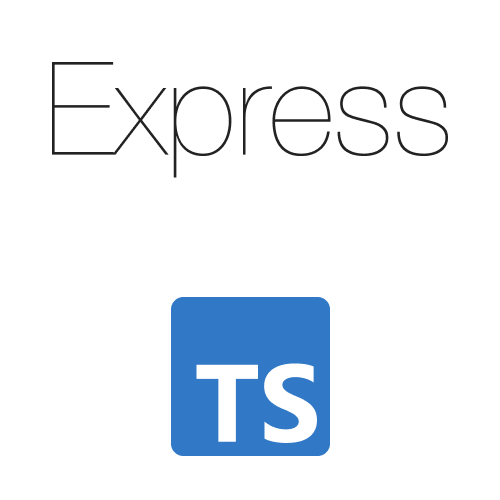

# Documentación de Express con TypeScript
Tipos de implementación, Formas de codificar, lo más actualizado 2024.
<!DOCTYPE html>
<html lang="en">
<head>
  <meta charset="UTF-8">
  <meta name="viewport" content="width=device-width, initial-scale=1.0">
  <link rel="stylesheet" href="readme-style.css">
  <link rel="preconnect" href="https://fonts.googleapis.com">
<link rel="preconnect" href="https://fonts.gstatic.com" crossorigin>
<link href="https://fonts.googleapis.com/css2?family=Work+Sans&display=swap" rel="stylesheet">
</head>
<body>
<h1 classname="h1-readme">¡Hola, soy <b>Ramiro Navarrete</b>! </h1>

   
    
   
Este repositorio es mi espacio para compartir con vos, las buenas prácticas, fundamentos esenciales, sintaxis, implementaciones y técnicas útiles utilizando las tecnologias: Express y TypeScript.

   

      
   

  
  
Vivo y desarrollo en Argentina, y estoy emocionado de ofrecerte conocimientos que te ayudarán a mejorar tus habilidades en el desarrollo de aplicaciones web.

</body>
</html>

## Totalmente Gratis
Es de contenido gratuito FREE, podés clonar el repositorio o tambien aportar valor para todos nosotros.😎

## Contenido

1. **Documentación Detallada 📚:**
   - Aquí encontrarás mi perspectiva detallada sobre las mejores prácticas al trabajar con Express y TypeScript, desde la configuración inicial hasta patrones avanzados de desarrollo.

2. **Ejemplos Prácticos 🎢:**
   - A lo largo del repositorio, te muestro ejemplos prácticos que ilustran cómo aplicar las técnicas y conceptos que discutimos.

3. **Guías Paso a Paso 🚦:**
   - He preparado guías paso a paso para ti, ya sea que estés buscando una introducción o quieras perfeccionar tus habilidades en una área específica.

4. **Consejos de Rendimiento 🚀:**
   - Descubre sugerencias y trucos que he aprendido para optimizar el rendimiento de tus aplicaciones Express escritas en TypeScript.

## ¿Cómo Puedes Contribuir? 

¡Tu contribución es más que bienvenida! Si encuentras errores, tienes sugerencias o deseas agregar algo nuevo, no dudes en abrir un *pull request* 🚨. Este repositorio es un esfuerzo colaborativo, y juntos podemos hacerlo una valiosa fuente de conocimiento para nuestra comunidad.

## Colabora aportando tu Star! 🌟

Gracias por tomarte el tiempo de explorar este repositorio 🤜🏻🤛🏻. 
Espero sinceramente que encuentres la información útil para tu desarrollo con Express y TypeScript. Si este recurso te resulta valioso, considera darle una estrella al repositorio. Tu apoyo significa mucho y fortalece nuestra comunidad de programadores en América Latina 🌎.

¡Feliz Codificación, a mandarle pa! 🚀
